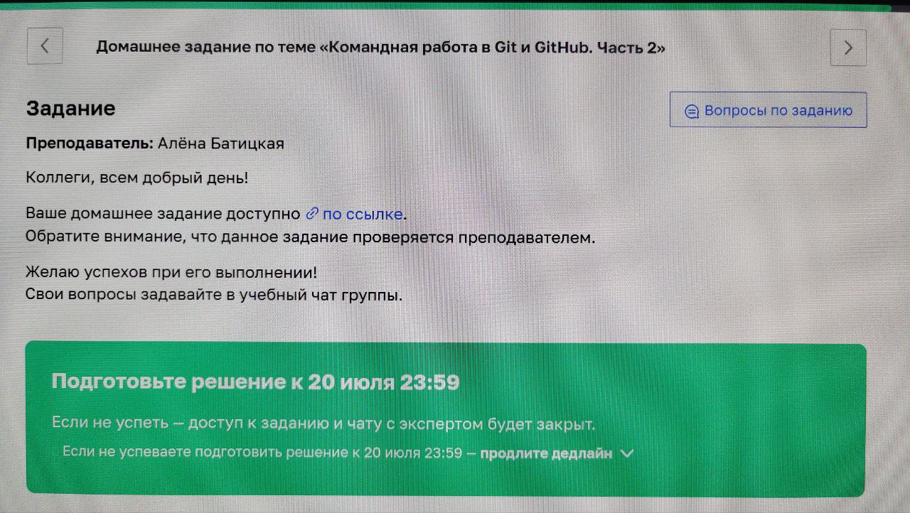

# Выполнение задания «Командная работа в Git & GitHub. Часть 2.»

## Задание

Мне дано такое задание:



## Что нужно сделать:

- [x] Локальный репозиторий
- [x] Фотографию
- [x] Текст с информацией о себе
- [x] Зафиксировать формирование данных в локальном репозитории
- [x] Создать удаленный репозиторий на GitHub
- [x] Связать репозитории и отправить изменения в удаленный
- [x] Опубликовать информацию о себе на GitHub Pages

## Требования к заданию

1. Должна быть информация о себе
2. Использование "по полной" возможностей Markdown
3. По всей видимости, предполагается, что публикуемая информация должна иметь признаки уникальности; преподаватель должен видеть, что текст сформирован слушателем, а не заимствован откуда-то из Интернета

## Мои ограничения к выполнению задания

1. Так как информация будет опубликована **на общедоступном сервисе**, не считаю возможным публикацию каких-либо своих персональных данных

---

## Примененный подход к выполнению задания

Публикуемая информация будет описывать выполнение мной *данного задания*

## Выполнение требований

| Требование | Пояснение |
|------------|-----------|
| Информация о себе | Задание выполняется мной, следовательно, информация о способе его выполнения является информацией обо мне
| Использование возможностей | Мной использовано, по меньшей мере, 75% возможностей, описываемых в шпаргалке [^1]
| Уникальность данных | Публикуемая информация содержит уникальные характеристики моего задания и уникальный подход к его решению

[^1]: [Шпаргалка](https://docs.yandex.ru/docs/view?tm=1689791370&tld=ru&lang=en&name=markdown-cheat-sheet.pdf&text=шпаргалка%20markdown%20в%20виде%20pdf&url=https%3A%2F%2Fwww.collectiveray.com%2Fimages%2Ffiles%2Fmarkdown-cheat-sheet.pdf&lr=0&mime=pdf&l10n=ru&sign=b44d0d78a58ed9f398cac5cfab8ebfbc&keyno=0&nosw=1&serpParams=tm%3D1689791370%26tld%3Dru%26lang%3Den%26name%3Dmarkdown-cheat-sheet.pdf%26text%3D%25D1%2588%25D0%25BF%25D0%25B0%25D1%2580%25D0%25B3%25D0%25B0%25D0%25BB%25D0%25BA%25D0%25B0%2Bmarkdown%2B%25D0%25B2%2B%25D0%25B2%25D0%25B8%25D0%25B4%25D0%25B5%2Bpdf%26url%3Dhttps%253A%2F%2Fwww.collectiveray.com%2Fimages%2Ffiles%2Fmarkdown-cheat-sheet.pdf%26lr%3D0%26mime%3Dpdf%26l10n%3Dru%26sign%3Db44d0d78a58ed9f398cac5cfab8ebfbc%26keyno%3D0%26nosw%3D1), которой я пользовался при выполнении задания 

## Описание действий по выполнению задания

### Локальный репозиторий

```
mkdir ~/PROJECTS/AboutMe
cd ~/PROJECTS/AboutMe
git init
```

### Фотография

- Использование ПО Flameshot для снятия копии части экрана [^2]
- Результат сохранен в файл foto.jpg

[^2]: На самом деле, сфотографировал, конечно, телефоном

### Текст с информацией о себе

```
vi README.md
```

### Просмотр результата формирования текста

Для просмотра я использовал инструмент grip

```
pip install grip
grip -b ~/PROJECTS/AboutMe/README.md
```

### Фиксация изменения данных

В соответствии с информацией из [презентации](https://netology.ru/profile/program/git-76/lessons/283064/lesson_items/1522046)

### Работа с удаленным репозиторием

В соответствии с информацией из [презентации](https://netology.ru/profile/program/git-76/lessons/283065/lesson_items/1522057)

### Публикация на на GitHub Pages

В соответствии с информацией из [презентации](https://netology.ru/profile/program/git-76/lessons/283067/lesson_items/1522073)

---

